# 📚 JixunReadreport - 经典图书封面

精选经典图书封面合集，手动从豆瓣收集。

## 封面列表

共 **66** 本图书封面。

| 序号 | 书名 | 封面 |
|------|------|------|
| 1 | 1984 | 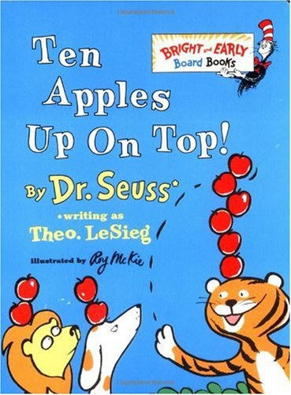 |
| 2 | 万历十五年 |  |
| 3 | 三体 | 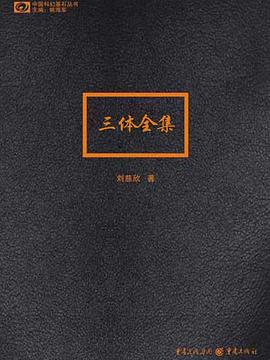 |
| 4 | 东方开车谋杀案 |  |
| 5 | 人类简史 |  |
| 6 | 人间词话 | 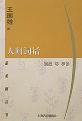 |
| 7 | 傲慢与偏见 |  |
| 8 | 刚刚离开的世界 | 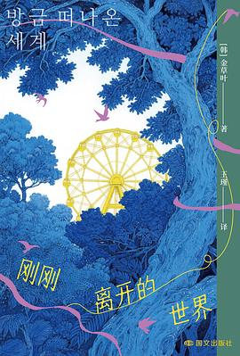 |
| 9 | 制作 |  |
| 10 | 去而复返 |  |
| 11 | 台北人 | 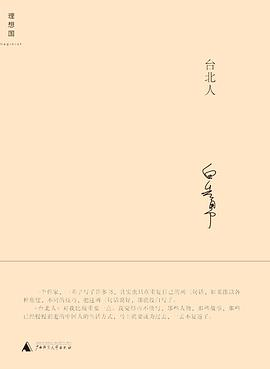 |
| 12 | 史记 | 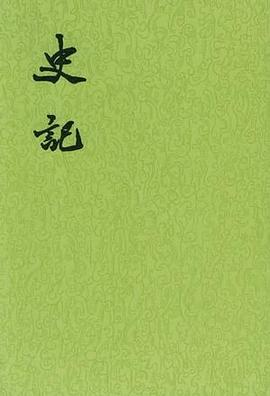 |
| 13 | 呐喊 |  |
| 14 | 呼兰河传 |  |
| 15 | 哈利波特 | 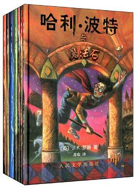 |
| 16 | 哭泣的骆驼 |  |
| 17 | 唐诗三百首 | 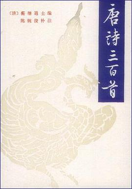 |
| 18 | 四世同堂 |  |
| 19 | 围城 | 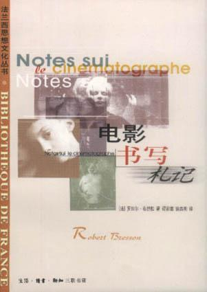 |
| 20 | 基督山伯爵 |  |
| 21 | 她的生活 | 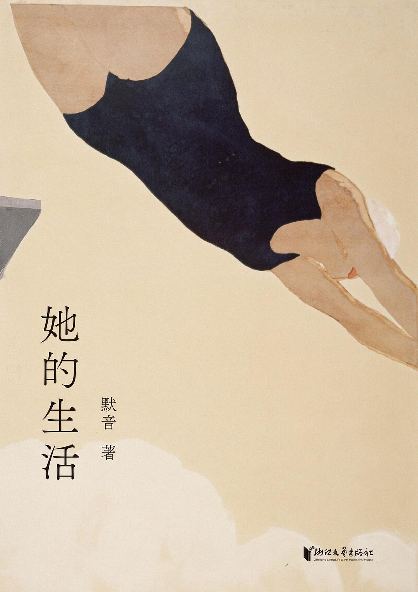 |
| 22 | 嫌疑人X的献身 |  |
| 23 | 对工作说不 |  |
| 24 | 射雕英雄传 |  |
| 25 | 小王子 | 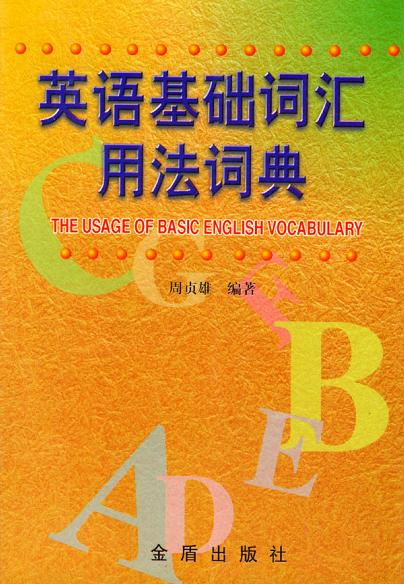 |
| 26 | 少女中国 | 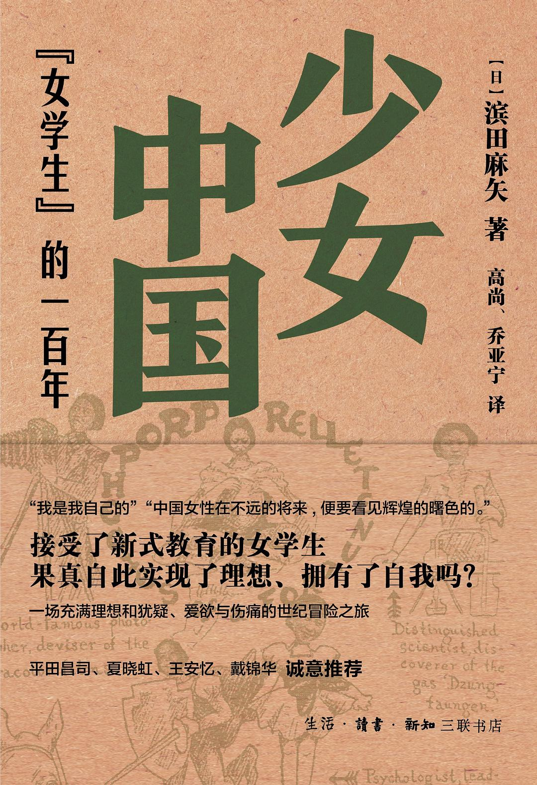 |
| 27 | 平凡的世界 | 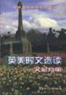 |
| 28 | 幻想底尽头 | 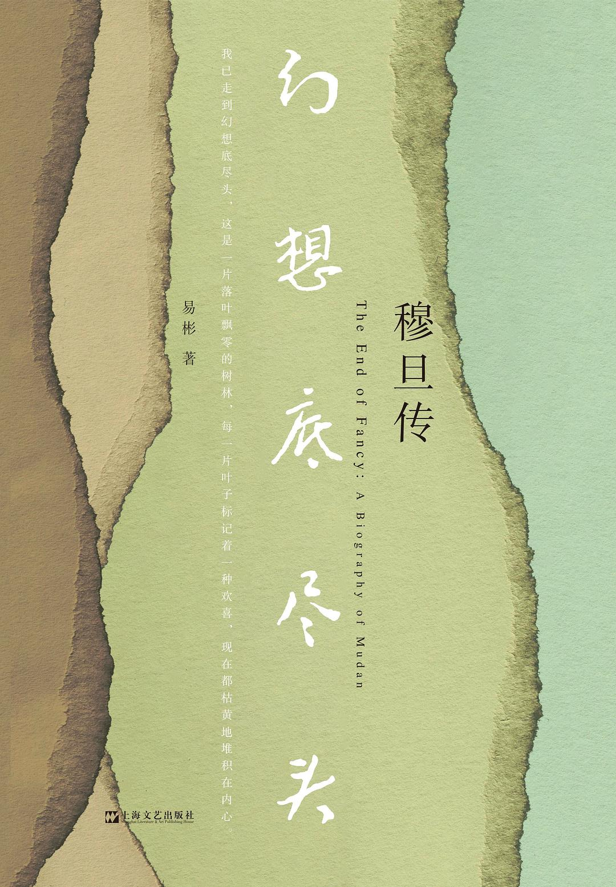 |
| 29 | 悲惨世界 | 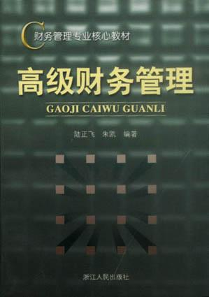 |
| 30 | 我与地坛 | 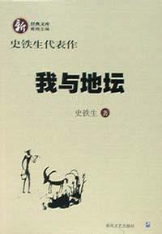 |
| 31 | 教父 |  |
| 32 | 明朝那些事 | 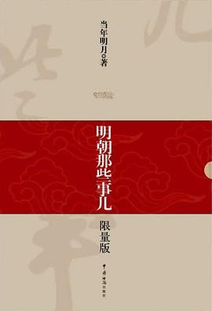 |
| 33 | 昨日的世界 |  |
| 34 | 月亮和六便士 |  |
| 35 | 朝花夕拾 | 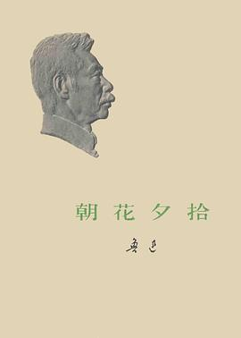 |
| 36 | 杀死一只知更鸟 |  |
| 37 | 极北森林 | 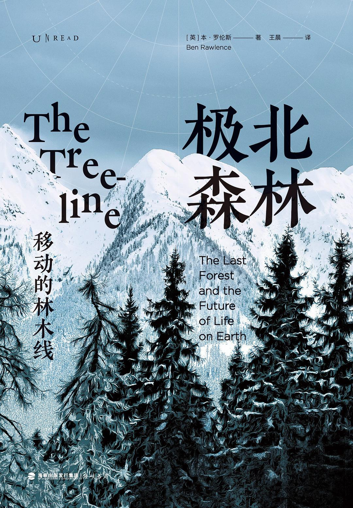 |
| 38 | 树上的男爵 | 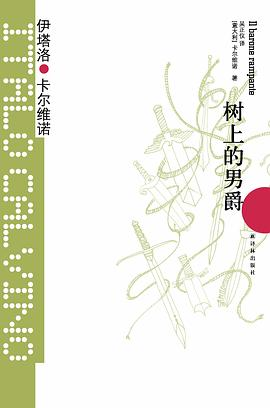 |
| 39 | 格林童话 | 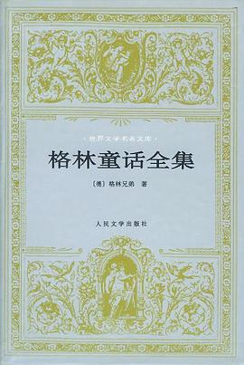 |
| 40 | 毛泽东选集 |  |
| 41 | 活着 |  |
| 42 | 流俗地 | 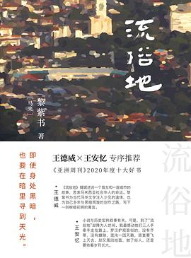 |
| 43 | 浮游直上 |  |
| 44 | 海子的诗 |  |
| 45 | 白夜行 |  |
| 46 | 白象 | 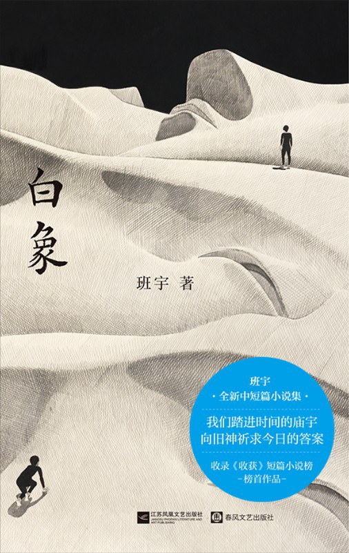 |
| 47 | 白鹿原 | 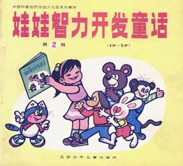 |
| 48 | 百年孤独 | 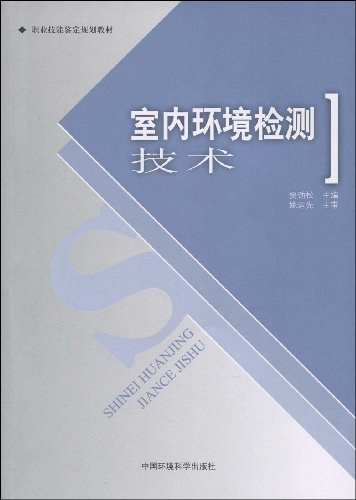 |
| 49 | 神雕侠侣 | 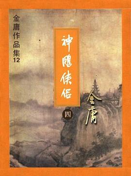 |
| 50 | 福尔摩斯 | 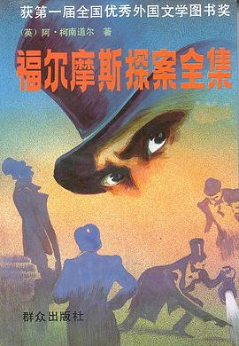 |
| 51 | 紫云村 | 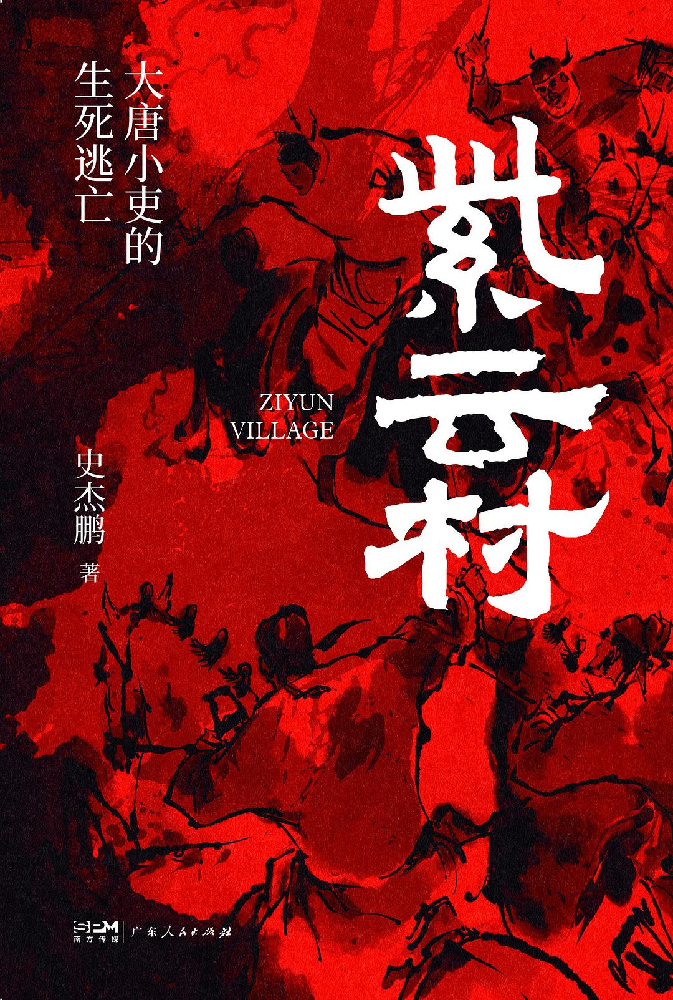 |
| 52 | 红楼梦 | 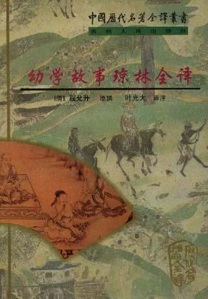 |
| 53 | 罪与罚 |  |
| 54 | 美丽新世界 | 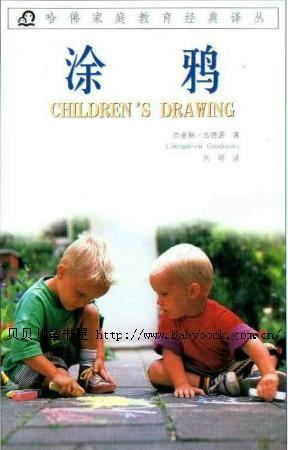 |
| 55 | 肖申克的救赎 |  |
| 56 | 艺术的故事 | 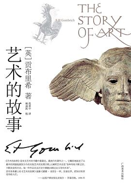 |
| 57 | 茶馆 |  |
| 58 | 西游记 | 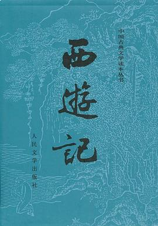 |
| 59 | 要有光 | 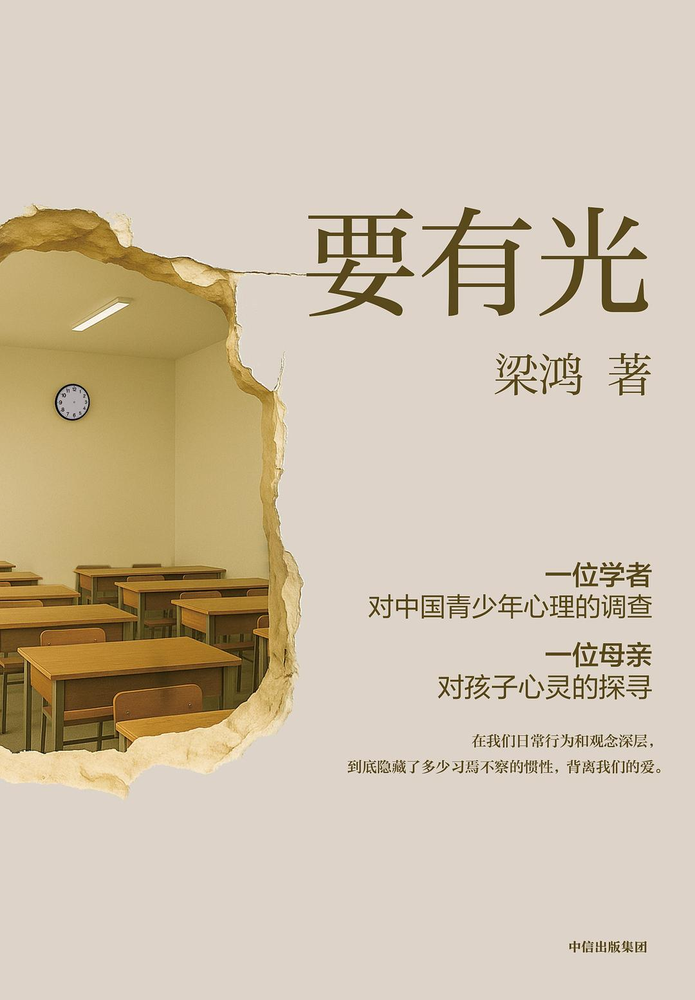 |
| 60 | 诗经 |  |
| 61 | 追风筝的人 | 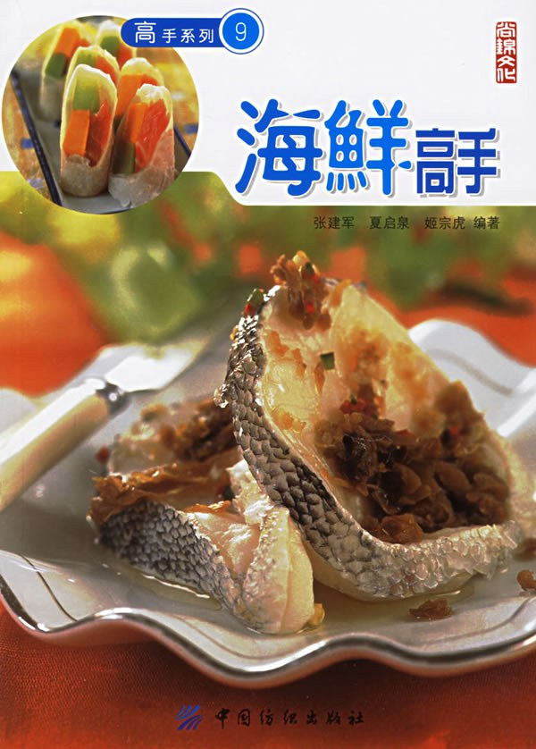 |
| 62 | 邓小平时代 |  |
| 63 | 野草 | 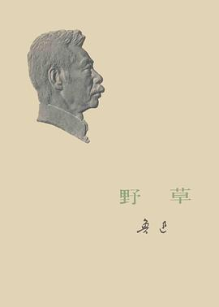 |
| 64 | 隐秘的角落 |  |
| 65 | 霍乱时期的爱情 | 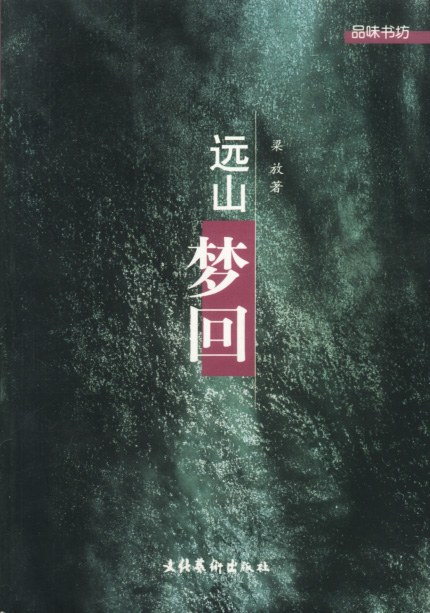 |
| 66 | 飘 |  |

## 说明

- 封面来源：豆瓣图书
- 手动收集确保封面与书名正确匹配
- 仓库地址：https://github.com/727997651-png/JixunReadreport
